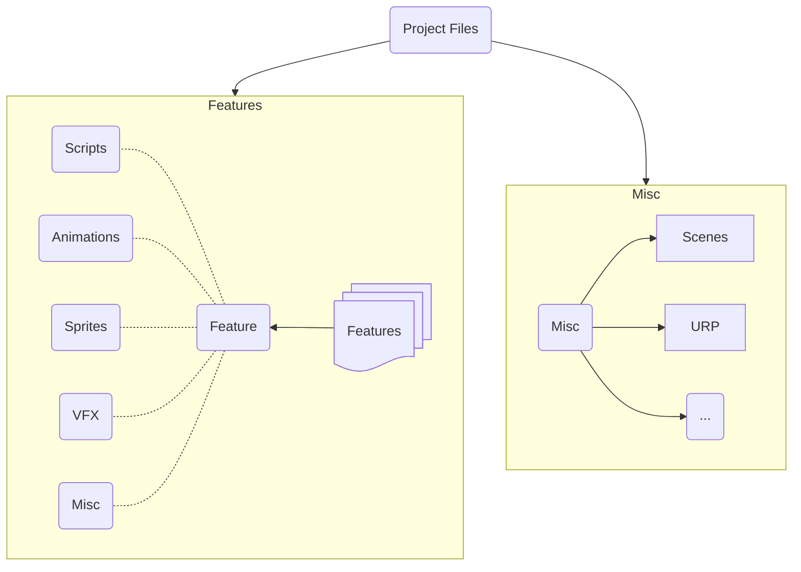

# Модульная архитектура

# Файловая архитектура

# Файл нейминг

## Категории файлов

1. Анимации
`Anim_[Объект]_[Действие]_[Состояние/Доп. атрибуты]`

* Пример:
    * `Anim_Player_Run_Loop`
    * `Anim_Enemy_Attack_Fast`
    * `Anim_UI_ButtonClick`
 
2. Материалы
`Mat_[Объект/Назначение]_[Характеристика]`

* Пример:
    * `Mat_Environment_Grass`
    * `Mat_Character_Skin`
    * `Mat_UI_Button`
 
3. Спрайты
`Sprite_[Категория]_[Название/Состояние]_[Размер/Версия]`

* Пример:
    * `Sprite_Icons_Coin_64x64`
    * `Sprite_Character_Jump_128x128`
    * `Sprite_UI_Menu_Highlight`
 
4. Префабы
`Prefab_[Объект]_[Назначение/Тип]`

* Пример:
    * `Prefab_Enemy_Spearman`
    * `Prefab_Player_MainCharacter`
    * `Prefab_UI_PauseMenu`
 
5. Аудио
`Audio_[Категория]_[Описание]_[Формат/Длина]`

* Пример:
    * `Audio_UI_Click_Short`
    * `Audio_Environment_Wind_Loop`
    * `Audio_Character_Footstep_Grass`

 6. Шрифты
`Font_[Название]_[Размер/Характеристики]`

* Пример:
    * `Font_Arial_Regular_14pt`
    * `Font_ComicSans_Bold`
 
7. Сцены
`Scene_[Категория]_[Название]`

* Пример:
    * `Scene_MainMenu`
    * `Scene_Level1_Forest`
 
8. Шейдеры
`Shader_[Категория]_[Тип/Особенности]`

* Пример:
    * `Shader_UI_Outline`
    * `Shader_Environment_Water`
 
