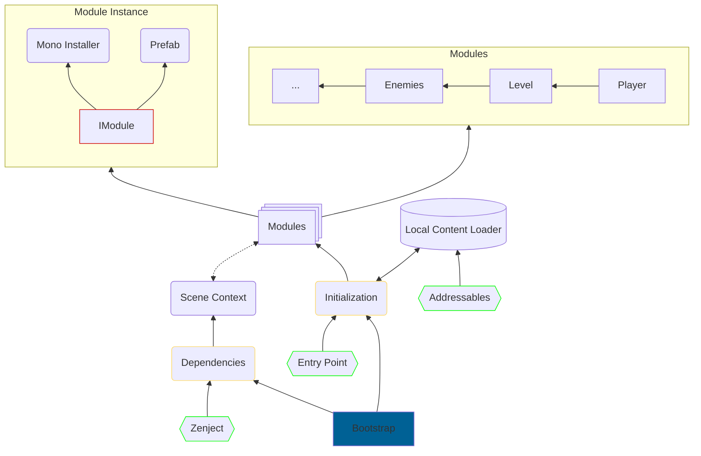

# Модульная архитектура проекта

```mermaid
flowchart BT
    classDef bar stroke:#0f0
    classDef red stroke:#cc0000
    classDef yellow stroke:#ffd966
    classDef main fill:#006195
    Bootstrap:::main-->Init(Initialization):::yellow;
    Bootstrap-->Dep(Dependencies):::yellow;
    
    Init-->Mods@{ shape: procs, label: "Modules"}
    
    Dep-->SceneContext;
    Zenject:::bar@{ shape: hex, label: "Zenject" }-->Dep;
    EntryPoint:::bar@{ shape: hex, label: "Entry Point" }-->Init;
    Addressables:::bar@{ shape: hex, label: "Addressables" }-->LocalContentLoader;
    SceneContext(Scene Context)<-.->Mods;
    Mods-->ModuleGraph;
    
    subgraph ModuleGraph [Module Instance]
    direction BT
    IModule:::red-->MonoInstaller(Mono Installer);
    IModule-->Prefab(Prefab);
    end

    subgraph Modules
    direction RL
    Player-->Level;
    Level-->Enemies;
    Enemies-->Etc[...];
    end

    Mods-->Modules;
    Init<-->LocalContentLoader@{ shape: cyl, label: "Local Content Loader" };
```
