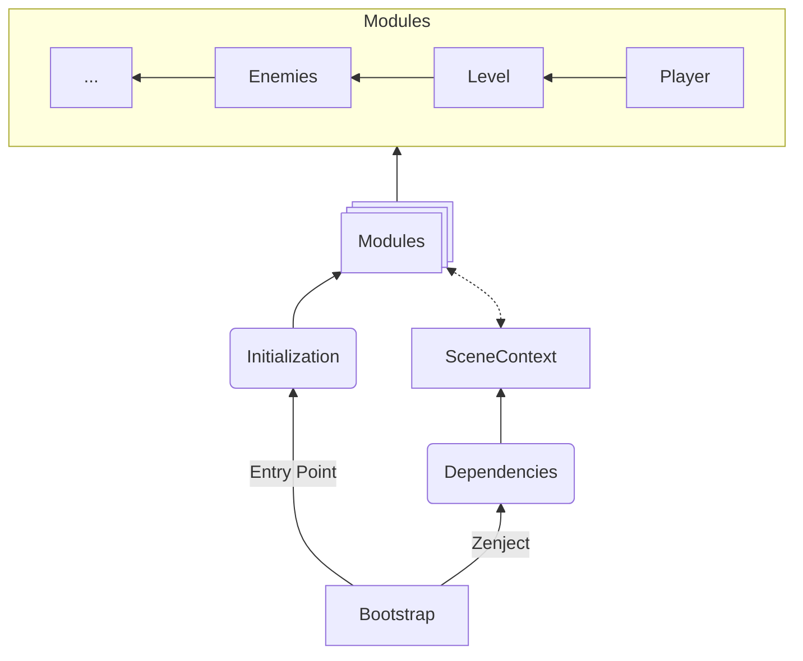

```mermaid
flowchart BT
    Bootstrap-->|Entry Point| Init(Initialization);
    Bootstrap-->|Zenject| Dep(Dependencies);
    
    Init-->Mods@{ shape: procs, label: "Modules"}

    
    Dep-->SceneContext;
    SceneContext<-.->Mods;

    subgraph Modules
    direction RL
    Player-->Level;
    Level-->Enemies;
    Enemies-->Etc[...];
    end

    Mods-->Modules;
```
